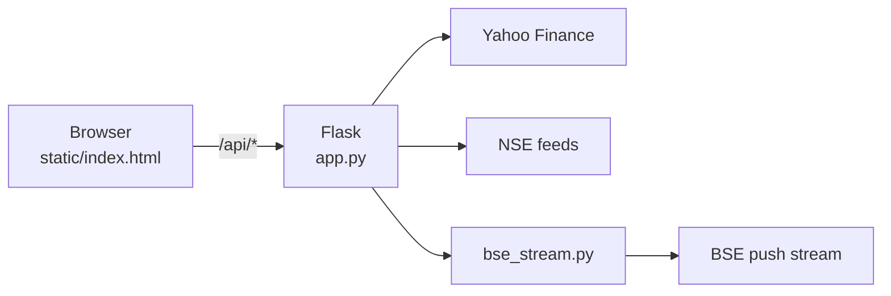

# Orazio

A self-hosted, TradingView-style chart for Indian and global indices. Flask backend, Lightweight-Charts frontend. No build step, no database, no API keys.

## Features

- **Live candles.** Quotes every 2 s; the newest candle opens locally, so the chart keeps up with the market.
- **Data-age badge.** `Live · 3s`, amber `Delayed 10m` for provider-delayed feeds, grey `Closed`.
- **Real-time SENSEX** from BSE's own push stream (Yahoo delays it ~15 min).
- **Call auction (CAS).** A panel with a countdown, a stock-by-stock auction feed with order books, and a full-screen **Live CAS** window: NIFTY, BANK NIFTY, NIFTY IT and SENSEX in four quadrants, each measured against the last value at 15:14:59.
- **Charting.** 11-index rail, candles/bars/line/area, 1m–1D bars, 1D–All ranges, drag left for older days, SMA and volume, symbol search.
- **Derivatives.** Cash/futures toggle for SPX, Nasdaq and Dow; options chains for US stocks.

## Quick start

```bash
pip install -r requirements.txt
python app.py        # then open http://localhost:5000
```

## Where each index's data comes from

Measured on Mon 21 Sep 2026.

| Index | Live price | Age | Call-auction data |
|---|---|---|---|
| NIFTY 50, BANK NIFTY, NIFTY IT | Yahoo tick (NSE feed for the official close) | 1–5 s | NSE per-stock feed, ~50 s snapshots; index indicative ~1/min |
| SENSEX | BSE push stream (REST fallback) | 2–3 s | BSE stream, real-time |
| S&P 500, Nasdaq, Dow | Yahoo | not measured (US closed) | none public |
| KOSPI, TAIEX, CSI 300, Shanghai | Yahoo | none at close | none found |
| ES=F, NQ=F, YM=F futures | Yahoo (CME) | **~10 min delayed** | n/a |

Notes: `NQ=F` is Nasdaq-100, not the Composite. Candle history comes from Yahoo everywhere except SENSEX, where the recent bars are built from BSE's stream. After the auction Yahoo's NIFTY tick goes stale (it stopped at 15:17:32, showing 23429.00 against an official close of 23414.30), so NSE's index feed supplies the close.

## What is not real-time

- NSE only refreshes its indicative index values about once a minute, so the NIFTY-family CAS charts are stepped. SEBI has proposed dropping those values altogether.
- Free sources tick about every 11 s at best; sub-second data needs a paid or broker feed.
- The US, Korean, Taiwanese and Chinese indices have no public auction feed.

## How it fits together



| Path | Purpose |
|---|---|
| `app.py` | API routes, source selection and fallbacks, CAS logic |
| `bse_stream.py` | BSE Socket.IO client, TLS verified against the missing intermediate certificate |
| `static/` | Frontend (`index.html`) and design tokens (`styles.css`) |
| `tasks/` | Spec, plan and todo history |

## Limits

- Yahoo, NSE and BSE endpoints are the ones their own websites call, not supported APIs. Any can change or block, and the app falls back rather than erroring. A personal charting tool, not a trading-grade feed.
- NIFTY-family candles end at 15:14 (Yahoo has no bars during the auction); the closing value shows in the price.
- Runs on Flask's development server. Don't expose it to the internet.
