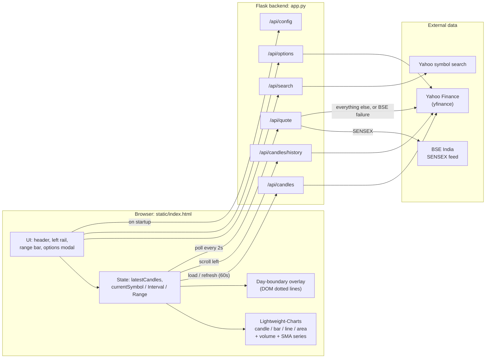
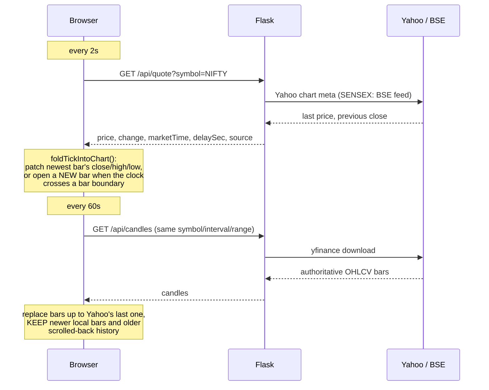
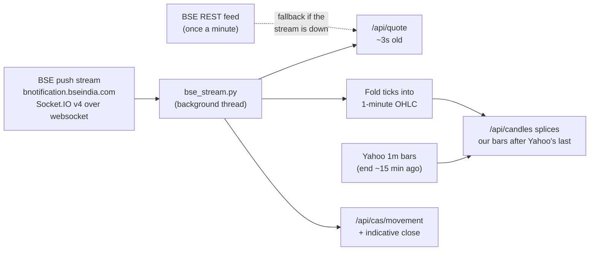
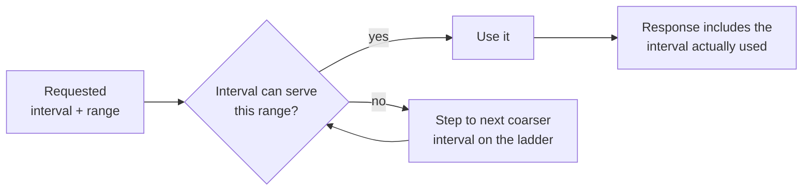
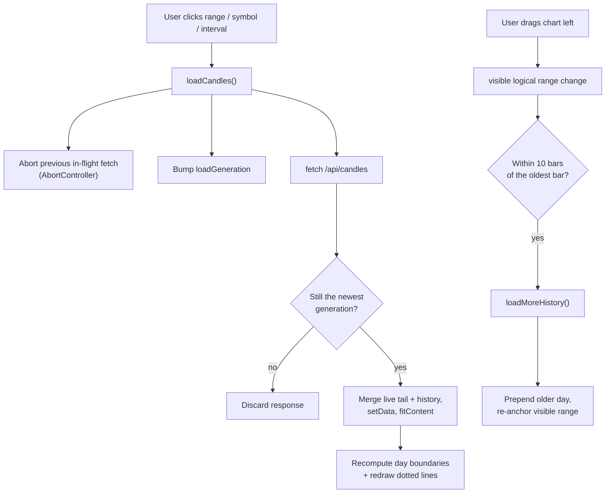

# Orazio

A self-hosted, TradingView-style charting app for Indian and global indices and stocks. A small Flask backend fetches market data from Yahoo Finance (via `yfinance` and Yahoo's chart API), BSE's live push stream for SENSEX, and NSE's own feeds for the auction and the official close. A single-page frontend renders it with [Lightweight-Charts](https://github.com/tradingview/lightweight-charts) v4.

No build step, no database, no API keys.

## Features

- **Live candles.** Quotes poll every 2s. A new candle opens locally at each bar boundary, so the chart is not stuck waiting for Yahoo's delayed bars (see [Live data](#live-data-why-it-does-not-lag)).
- **Honest data freshness.** A status badge shows the age of the latest tick (`Live · 6s`), turns amber for provider-delayed feeds (`Delayed 10m`, e.g. CME futures) and grey when the market is closed.
- **SENSEX from BSE's own push stream**, because Yahoo delays SENSEX by about 15 minutes. The stream ticks about twice a second, so the SENSEX price is ~3s old and its candles carry real intra-minute highs and lows (see [SENSEX](#sensex-working-around-a-15-minute-delay)).
- **Live CAS** — a separate full-screen window with the four Indian indices (NIFTY, BANKNIFTY, NIFTYIT, SENSEX) in a 2×2 grid, each a full-size chart measured against the **reference price: the last value at 15:14:59**. A dotted REF line marks it; the chart is green above and red below. Each header shows the move in points and %.
- **Call Auction panel** under the index list: the pre-open auction (09:00-09:15 IST) and closing session (15:40-16:00 IST) values for the NSE indices and SENSEX, with a countdown to the next window.
- **Independent interval and range controls.** Bar size (1m / 5m / 15m / 1h / 1D) and history range (1D / 5D / 1M / 3M / 6M / YTD / 1Y / 5Y / All) are separate. Impossible combinations are corrected server-side.
- **Drag left to load older days.** Intraday history loads lazily, one trading day per request, up to Yahoo's limit (about 7 days at 1m).
- **Dotted day-boundary lines** so separate sessions are easy to tell apart.
- **Quick-access rail:** NIFTY, BANKNIFTY, NIFTYIT, SENSEX, SPX, NASDAQ, DOWJONES, KOSPI, TAIEX, CHINA (CSI 300), SSE (Shanghai Composite).
- **Cash / Futures toggle** for SPX, NASDAQ and DOWJONES (ES=F, NQ=F, YM=F).
- **Options chain panel** for symbols Yahoo covers, e.g. US stocks.
- Candles, bars, line and area styles. Optional SMA20 / SMA50. Volume pane. Free-text symbol search.

## Quick start

```bash
git clone https://github.com/prathamkul007-max/trading-view-self-host.git
cd trading-view-self-host
pip install -r requirements.txt
python app.py
```

Open **http://localhost:5000**.

Tested on Python 3.13. The chart library loads from a CDN (`unpkg.com`), so the browser needs internet access.

## Data sources: what feeds each index

Every figure below was measured on a live trading day (Mon 21 Sep 2026) unless it says otherwise. "Age" is how old the newest tick is when the app displays it.

| Index | Ticker | Live price comes from | Age | Candles | After the close | Call-auction (CAS) data |
|---|---|---|---|---|---|---|
| **NIFTY 50** | `^NSEI` | Yahoo chart API tick | 1-5 s (Yahoo ticks about every 11 s) | Yahoo 1-minute bars, plus a live candle built from ticks | NSE's own index feed supplies the official close, because Yahoo's tick stops at the auction (last tick 15:17:32) | Yes. NSE per-stock CAS feed (~50 s snapshots) and NSE's indicative index value (~1 per minute) |
| **BANK NIFTY** | `^NSEBANK` | Yahoo chart API tick | 1-5 s | as NIFTY 50 | as NIFTY 50 | Yes, as NIFTY 50 |
| **NIFTY IT** | `^CNXIT` | Yahoo chart API tick | 1-5 s | as NIFTY 50 | as NIFTY 50 | Yes, as NIFTY 50 |
| **SENSEX** | `^BSESN` | **BSE push stream** (about 2 updates per second); BSE REST as fallback | 2-3 s | Yahoo history (its SENSEX bars are ~15 min delayed) plus the app's own bars built from the stream, with real intra-minute highs and lows | BSE's stream carries the final close | Yes, and real-time: BSE's stream carries the indicative close continuously |
| **S&P 500** | `^GSPC` | Yahoo chart API | not measured (US market was closed) | Yahoo 1-minute bars | Yahoo | None public |
| **Nasdaq Composite** | `^IXIC` | Yahoo chart API | not measured (US market closed) | Yahoo | Yahoo | None public |
| **Dow Jones** | `^DJI` | Yahoo chart API | not measured (US market closed) | Yahoo | Yahoo | None public |
| **KOSPI** | `^KS11` | Yahoo chart API | at close: none (last tick 12:00:40 IST, close 12:00) | Yahoo; its 1-minute bars ended 11:30 IST, half an hour before the close | Yahoo | None public found |
| **TAIEX** | `^TWII` | Yahoo chart API | at close: none (last tick 11:03 IST, close 11:00) | Yahoo | Yahoo | None public found |
| **CSI 300** ("CHINA") | `000300.SS` | Yahoo chart API | at close: none (last tick 12:30:29 IST, close 12:30) | Yahoo | Yahoo | None public found |
| **Shanghai Composite** ("SSE") | `000001.SS` | Yahoo chart API | at close: none (last tick 12:30:29 IST) | Yahoo | Yahoo | None public found |

For the Asian indices the age *during* their sessions was not measured, because they had already closed when checked; "none" means the last tick matched the scheduled close.

### Futures

| Underlying | Futures ticker | What it actually is | Age |
|---|---|---|---|
| S&P 500 | `ES=F` | CME E-mini S&P 500 (front month) | **~10 minutes** (measured 10.1 min while open; a Yahoo/CME licensing delay) |
| Nasdaq | `NQ=F` | CME E-mini **Nasdaq-100**. This is *not* the Nasdaq Composite that the NASDAQ index charts | ~10 minutes |
| Dow Jones | `YM=F` | CBOT E-mini Dow | ~10 minutes |

Yahoo carries no futures or option chains for the Indian indices, so the Futures toggle only appears for the three above, and the Options panel shows "unavailable" for NIFTY, BANK NIFTY, NIFTY IT and SENSEX. Options work for US stocks such as AAPL.

### Which source wins

The quote endpoint tries sources in this order and reports which one answered (the `source` field):

| Symbol | Order |
|---|---|
| SENSEX | BSE push stream → BSE REST (once a minute) → Yahoo (~15 min delayed) → `yfinance` |
| NIFTY 50, BANK NIFTY, NIFTY IT | Yahoo tick → NSE `allIndices` (only when Yahoo's tick is over 2 minutes stale *and* NSE's stamp is newer, which is what happens after the auction) → `yfinance` |
| Everything else | Yahoo chart API → `yfinance` |

**Why NSE is not the primary source for NIFTY:** measured, NSE's `allIndices` refreshes about once a minute and runs 1-2 minutes behind the clock, so Yahoo's direct feed is faster during the session. NSE is only used when Yahoo has gone quiet.

**A real gap this fixes:** after the closing auction Yahoo kept reporting NIFTY 23429.00 while the official close was 23414.30. With the fallback, the displayed close matches NSE's for NIFTY, BANK NIFTY and NIFTY IT, and matches BSE's for SENSEX.

### What is not real-time, and why

- **NSE indicative index values update about once a minute.** NSE's per-stock CAS snapshot itself refreshes every ~50 seconds (stamps 15:20:02, 15:20:56, 15:21:49, 15:22:44 …), so rebuilding an index from its constituents cannot be faster. The NIFTY, BANK NIFTY and NIFTY IT charts in the Live CAS window are therefore stepped, and say so.
- **SENSEX is real-time in the auction only because BSE pushes it.** NSE publishes nothing equivalent.
- **SEBI has proposed that exchanges stop publishing the indicative index value** during CAS and keep only per-stock indicative prices. If that is adopted, the NSE index cards will go blank.
- **Free sources cannot reach tick-by-tick.** Yahoo ticks about every 11 seconds. Sub-second data needs a paid or broker feed (e.g. Zerodha Kite Connect).
- **US indices have no public auction feed.** Nasdaq and NYSE closing-imbalance data is subscription-only; only T+1 volume is free.

## Architecture



### Repository layout

| Path | Purpose |
|---|---|
| `app.py` | Flask app: symbol aliases, interval/range validation, all `/api/*` routes |
| `bse_stream.py` | BSE push-stream client (Socket.IO v4 websocket, verified TLS) |
| `static/index.html` | The frontend: markup and JS |
| `static/styles.css` | Design tokens and styles (the chart reads its colours from the same tokens) |
| `requirements.txt` | `flask`, `flask-cors`, `yfinance`, `requests`, `websockets`, `certifi`, `cryptography` |
| `tasks/` | Spec-driven-development docs: `spec.md`, `plan.md`, `todo.md` |
| `graphify-out/` | Auto-generated knowledge graph of this repo (`graph.html`, `GRAPH_REPORT.md`) |
| `.mcp.json` | Optional Chrome DevTools MCP config for browser-driven testing |

## Live data: why it does not lag

Yahoo's 1-minute bars can trail the live tick by up to a minute (about 15 minutes for SENSEX), so a chart built only from `/api/candles` can miss the current minute. Orazio builds the newest candle from live ticks instead.



Guards that keep the local candles honest:

- A new bar opens only if the price actually changed in the last 90s, so a frozen post-close quote cannot spawn flat candles.
- Bars are anchored to the last real bar's grid (NSE hourly bars start at :15).
- Live folding applies when the quote's own tick is fresh (under 3 minutes old) or the newest bar is recent. This is what lets SENSEX show live candles even though Yahoo's SENSEX bars are 15 minutes old. Otherwise (market closed) nothing is painted onto old bars.
- Locally-built bars have zero volume until Yahoo publishes the real bar.

## SENSEX: working around a 15-minute delay

Yahoo delays SENSEX by about 15 minutes — the quote *and* the 1-minute bars. BSE's own website gets SENSEX from a push stream, and so does Orazio.



- The channels (`SenSexValue`, `SensexIndicativePrice`) and message fields were read out of BSE's own page code (`beta.bseindia.com/D90/Controller/factoryother.js`), not from published documentation.
- **Measured:** about 114 messages in 40 seconds, 33 distinct values. BSE's *REST* endpoint, by contrast, changes once a minute — an earlier version of this app only used that, which is why SENSEX candles used to be flat.
- **TLS:** BSE's server does not send its intermediate certificate (browsers repair that silently), so a stock client fails verification. Orazio does **not** disable verification: it fetches the missing GlobalSign intermediate from the leaf certificate's own "CA Issuers" link and adds it to the trust store, so the chain is still fully checked.
- If the stream is unreachable the app falls back to the REST endpoint and says so on the live-movement window.
- Candle coverage starts when the server starts; Yahoo supplies everything older than ~15 minutes, so after 15 minutes of uptime the two overlap and the chart is continuous.

## Call Auction Session (CAS)

The panel under the index list tracks India's two call-auction windows.

Timings are per SEBI circular HO/47/11/11(3)2025-MRD-POD2/I/2765/2026 (16 Jan 2026), which introduced the Closing Auction Session from **3 August 2026** for F&O-eligible stocks. Continuous trading in those names now stops at **15:15**, not 15:30.

| Window | Time (IST) | Stages |
|---|---|---|
| Pre-open auction | 09:00-09:15 | 09:00-09:05 order entry (market & limit) · 09:05-09:10 limit only, closing randomly between 09:08 and 09:10 · 09:10-09:12 matching · 09:12-09:15 buffer |
| Closing auction (CAS) | 15:15-15:35 | 15:15-15:20 reference price (VWAP of 15:00-15:15), no new orders · 15:20-15:25 order entry (market & limit) · 15:25-15:30 limit only, closing randomly between 15:28 and 15:30 · 15:30-15:35 matching, confirmation and closing price |
| Post-market | 15:50-16:00 | Market orders only, at the closing price |

CAS applies to F&O-eligible stocks; everything else keeps the old VWAP close and trades through to 15:30. The closing price is the level at which the most shares can be matched.

The panel names the current stage as it runs, and the session is read from NSE's own `marketStatus` rather than trusted to the clock, so a timetable change is reflected rather than silently mislabelled. Outside the windows the panel shows the last auction outcome (today's open versus the previous close) and counts down to the next window. Only NSE indices and SENSEX have a public auction feed; the others say so rather than showing a guess.

**View live feed** opens the auction itself, stock by stock. It switches source by session: during the closing auction it reads NSE's dedicated CAS feed (`/api/NextApi/apiClient/casApi?functionName=getCASData`, the endpoint behind nseindia.com's *Market Watch → Closing Auction Session* page, ~210 F&O names); during pre-open it reads `market-data-pre-open`. Outside a window that feed keeps serving its last snapshot, so the header says `Live` or `Snapshot`.

Closing-auction columns (all verified against NSE's live payload during the 15:20 order-entry stage): **IEP** is the indicative equilibrium price (`finalPrice` stays 0 until matching); **Imbalance MO** is the buy-minus-sell surplus of market orders (equal to `atoBuy - atoSell` in 210 of 210 rows, so positive means a buy surplus); **Imbalance @EP** is the same at the equilibrium price; change is measured against the **reference price** (`refrencePrice`, NSE's spelling); low/high band is the ±3% price band. In an order book, the rung flagged `true` is the equilibrium rung.

Pre-open view:

- Every name in the F&O universe (or all 2,425 listed names) with its IEP, % change, final quantity, total buy/sell quantity and at-the-open quantities. Sort by any column, filter by symbol.
- Click a row for that stock's **10-rung auction order book** — resting buy depth on the left, sell depth on the right, the equilibrium price highlighted.
- Market breadth across the top, refreshing every 3 seconds while the window is open.

NSE keeps serving the last window's snapshot after pre-open closes, so the header always says whether you are looking at a live auction or a snapshot, and gives its timestamp.

### Which indices have a public auction feed

Researched, not assumed:

| Market | Closing auction | Public live feed |
|---|---|---|
| NSE (NIFTY, BANKNIFTY, NIFTYIT) | 15:15-15:35 | Yes: per-stock CAS feed plus `indicativeClose` per index |
| BSE (SENSEX) | 15:15-15:35 | Index-level indicative close only (BSE's per-stock feed not found) |
| US (SPX, NASDAQ, DOW) | Nasdaq/NYSE closing cross, imbalance data from 15:50 ET | **No.** Imbalance feeds (NOII) are subscription products; only T+1 volume is free |
| KOSPI (KRX) | 15:20-15:30 closing single-price auction | None found |
| TAIEX (TWSE) | Closing call auction, simulated prices disclosed 13:25-13:30 | None verified |
| CHINA / SSE | Closing call auction 14:57-15:00 | None found |

The panel marks markets without a feed as unavailable rather than showing a guess.

BSE's *indicative* SENSEX values (`indicativePriceFlag`, `todayIndexClose`, `IChange`, `IpercChange`) arrive on the same push stream, so the SENSEX card in **Live CAS movement** is real-time; the NSE indices are sampled from `allIndices`, which NSE refreshes about once a minute, so their cards are coarser.

Note that during the Indian closing auction NIFTY and SENSEX look **frozen** on a normal chart: every constituent is in the auction, so nothing trades until the closing prices print around 15:35.

### Live CAS: how the reference is chosen

The closing auction is measured against the **last value at 15:14:59**, the final traded value before continuous trading stops at 15:15.

- **Before 15:15:00** the reference is unknown, so the window shows "awaiting reference" and a neutral baseline.
- **From 15:15:00** it locks for the day. It is the last tick at or before 15:14:59 from the app's own recorded series (Yahoo's real-time tick for the NSE indices, BSE's push stream for SENSEX), provided that tick is under two minutes stale. If the server was not running then, it falls back to the close of Yahoo's 15:14 one-minute bar.
- The x-axis is proportional to real time (15:10 to 15:36): the series is forward-filled to one point per second, because a 2-per-second stream and an 11-second tick would otherwise be spaced by index rather than by time.
- The value plotted is the **indicative** value when the auction has produced one, otherwise the last traded value; the header tag says which.

Only the Indian indices are shown. The other markets have no public auction feed, so there is nothing to chart.

## Interval and range resolution

Yahoo limits how far back each bar size goes, so `resolve_interval_range()` in `app.py` climbs a ladder to the finest interval that can serve the requested range.



| Interval | Max range it can serve |
|---|---|
| 1m | 5D |
| 5m, 15m | 1M |
| 1h | 1Y |
| 1D | All |

The ladder only moves to coarser bars, never finer. To avoid a wide range leaving a stale coarse interval behind, the frontend's range buttons always request `interval=1m` as a baseline.

## API reference

| Route | Params | Returns |
|---|---|---|
| `GET /api/config` | none | `quickIndices` (rail list), `futuresMap` (cash → futures ticker), `futuresMeta` (readable futures names) |
| `GET /api/candles` | `symbol`, `interval`, `range` | `{symbol, interval, range, candles[]}` (interval is the one actually used) |
| `GET /api/candles/history` | `symbol`, `interval`, `before` (unix ts) | One prior trading day of bars strictly before `before`, plus `exhausted` |
| `GET /api/quote` | `symbol` | `{price, change, changePercent, time, marketTime, delaySec, currency, source}`; `source` is `yahoo`, `bse`, `nse` or `yfinance` |
| `GET /api/search` | `q` | Yahoo symbol search results |
| `GET /api/cas` | none | Call-auction state: `phase`, `secondsRemaining`, per-index `open` / `indicativeClose`, and pre-open market breadth |
| `GET /api/cas/movement` | none | The four Indian indices only: `points` of `[epoch, value, indicative]`, the locked `reference` (last value at 15:14:59), BSE stream health |
| `GET /api/cas/feed` | `key` (`FO`/`ALL`), `symbol` | The auction feed stock by stock: IEP, change, ATO and buy/sell quantities, plus breadth. With `symbol`, that stock's 10-rung auction order book |
| `GET /api/options` | `symbol`, `expiry` (optional) | `{available, expiries, calls, puts}`, or `{available: false, reason}` |

Symbols are validated against `^[A-Za-z0-9^.\-=]{1,20}$`. Aliases such as `NIFTY`, `SPX` or `CHINA` are resolved to Yahoo tickers server-side (`SYMBOL_ALIASES` in `app.py`).

## Frontend request lifecycle

The frontend guards against stale responses, which matters because Yahoo round-trips are slow and users click quickly.



Other guards:

- `suppressRangeEvents` stops the scroll listener from reacting to changes the app made itself (`setData`, `fitContent`).
- `pollQuote()` discards a response if the symbol changed while it was in flight.
- `timeScale.minBarSpacing` is lowered to `0.05` so "All" (thousands of daily bars) fits instead of silently clamping to recent data.
- The 60s refresh preserves the visible time range instead of resetting zoom.

## Limits

- **All of this is unofficial data.** Yahoo's chart API, BSE's website endpoints and NSE's website endpoints are the ones those sites' own pages call. None is a supported API, any can change or block without notice, and the app degrades to its fallbacks rather than erroring. This is a personal charting tool, not a trading-grade feed.
- **BSE's TLS certificate is misconfigured** (the server omits its intermediate certificate). Orazio does not disable verification: it fetches the missing GlobalSign intermediate from the certificate's own "CA Issuers" link and verifies against that.
- **Yahoo's 1-minute history reaches back about 7 days**, 5- and 15-minute about 60 days.
- **The SENSEX candles built from BSE's stream exist only since the server started.** Yahoo supplies the older part, so after about 15 minutes of uptime the two overlap and the chart is continuous.
- **The Live CAS window's reference price and chart history are held in memory** and saved to a small file in the OS temp folder every 10 seconds, so a server restart during an auction does not lose them.
- Flask's development server is used (`threaded=True`). Do not expose it to the internet as it is.

## Development

The project uses spec-driven development. Read `tasks/spec.md`, `tasks/plan.md` and `tasks/todo.md` for the requirements, plan and history of bugs and fixes.

`.mcp.json` configures the Chrome DevTools MCP server so an AI coding agent can drive a real browser against `http://localhost:5000` for testing.
