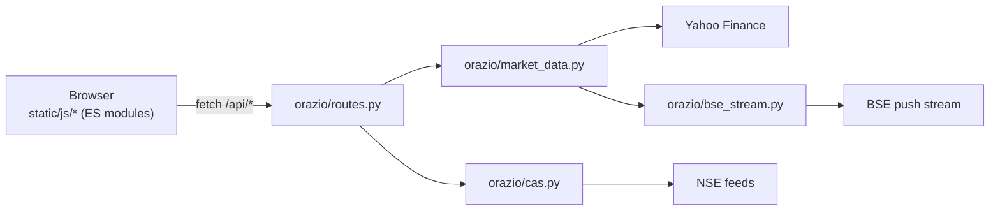

# Orazio

Self-hosted charting for Indian and global indices — Flask backend, Lightweight-Charts frontend. Runs on your machine, talks straight to Yahoo/NSE/BSE's own public endpoints. No login, no account, no API keys, nothing to pay for.

## Features

- Live candles — quotes every 2s, current bar gets patched in as it moves instead of waiting for a refetch.
- Data-age badge (`Live · 3s`, `Delayed 10m`, `Closed`) so a stale feed never looks like a broken app.
- SENSEX from BSE's own push stream — Yahoo delays it ~15 min.
- CAS terminal: a countdown panel, a 4-quadrant live movement view (NIFTY, BANK NIFTY, NIFTY IT, SENSEX vs. the 15:14:59 reference), and a stock-by-stock auction feed with order books — pre-open and closing auction both.
- Charting: 11-index rail, candles/bars/line/area, 1m–1D bars, 1D–All ranges, drag left for older days, SMA 20/50/200, volume, symbol search, a two-point measure tool (click two points, get Δ price/%/time).
- Cash/futures toggle for SPX/Nasdaq/Dow; options chains for US stocks.
- Market breadth (advances/declines) under NIFTY, BANK NIFTY, NIFTY IT, SENSEX, DOW JONES, S&P 500 and CSI 300 in the rail. NSE hands the first three out for free; the other four are computed here from each index's own constituents (batched yfinance calls, not a live feed) — for those four you also get a combined constituent volume figure, since indices themselves don't have a real "volume" (yfinance reports 0 for every index ticker). NASDAQ, KOSPI, TAIEX and Shanghai don't get a line — no accurate free constituent list exists for them, and a guessed subset would misrepresent the index.
- Top Movers tab: gainers/losers for the whole market, NIFTY, BANK NIFTY, SENSEX, DOW, S&P 500 or CSI 300 — the last four ranked from the same constituent data the breadth counts above are built from, not a second fetch.
- Light mode toggle, remembers your choice.

## Quick start

```bash
pip install -r requirements.txt
python app.py        # then open http://localhost:5000
```

## Where each index's data comes from

Measured on Mon 21 Sep 2026.

| Index | Live price | Age | Call-auction data |
|---|---|---|---|
| NIFTY 50, BANK NIFTY, NIFTY IT | Yahoo tick (NSE feed for the official close) | 1–5 s | NSE per-stock feed, ~50 s snapshots; index indicative ~1/min |
| SENSEX | BSE push stream (REST fallback) | 2–3 s | BSE stream, real-time |
| S&P 500, Nasdaq, Dow | Yahoo | not measured (US closed) | none public |
| KOSPI, TAIEX, CSI 300, Shanghai | Yahoo | none at close | none found |
| ES=F, NQ=F, YM=F futures | Yahoo (CME) | **~10 min delayed** | n/a |

Notes: `NQ=F` is Nasdaq-100, not the Composite. Candle history comes from Yahoo everywhere except SENSEX, where the recent bars are built from BSE's stream. After the auction Yahoo's NIFTY tick goes stale (it stopped at 15:17:32, showing 23429.00 against an official close of 23414.30), so NSE's index feed supplies the close.

## What is not real-time

- NSE only refreshes its indicative index values about once a minute, so the NIFTY-family CAS charts are stepped. SEBI has proposed dropping those values altogether.
- Free sources tick about every 11 s at best; sub-second data needs a paid or broker feed.
- The US, Korean, Taiwanese and Chinese indices have no public auction feed.

## How it fits together

Everything runs as one local process: the Flask server serves the page, answers `/api/*`, and polls the exchanges in background threads. Nothing is written anywhere but your own disk (a small seed file, so the CAS reference price survives a restart).



**Backend** (`orazio/`) — one module per concern:

| Path | Purpose |
|---|---|
| `app.py` | Thin entry point — creates the app and runs the dev server |
| `orazio/__init__.py` | App factory: wires the Flask app, CORS, and blueprint together |
| `orazio/config.py` | Environment-driven settings (debug, host, port) |
| `orazio/constants.py` | Static lookup tables (symbol aliases, ranges, CAS session windows, …) |
| `orazio/symbols.py` | Symbol validation and interval/range resolution |
| `orazio/candles.py` | Shapes yfinance OHLCV data into API rows |
| `orazio/market_data.py` | Live quote sources (Yahoo/BSE/yfinance/NSE) and the live-bar aggregator built on them |
| `orazio/cas.py` | Call Auction Session: phase/session logic, NSE index polling, reference-price calc, feed normalization; also NSE-native market breadth for NIFTY/BANK NIFTY/NIFTY IT |
| `orazio/constituents.py` | Self-computed breadth AND top movers for SENSEX/DOW/S&P 500/CSI 300 from one shared batched fetch of their own constituents (Wikipedia-scraped lists for the two big ones — not hand-typed); feeds both `/api/breadth` and `/api/movers` |
| `orazio/movers.py` | Top gainers/losers by universe (whole market, NIFTY, BANK NIFTY) — `/api/movers` |
| `orazio/nse_client.py` | Shared cookie-authenticated NSE JSON fetcher |
| `orazio/bse_stream.py` | BSE Socket.IO client, TLS verified against the missing intermediate certificate |
| `orazio/poller.py` | Starts every background thread exactly once |
| `orazio/routes.py` | HTTP routes — thin glue over the modules above |

**Frontend** (`static/js/`) — no build step, plain ES modules loaded by the browser:

| Module | Purpose |
|---|---|
| `state.js` | Shared app state, formatters, design tokens (recomputable — see `refreshColors()`) |
| `chart.js` | Lightweight-Charts setup, series, indicators, legend, theme reapplication |
| `data.js` | Candle loading, history lazy-load, live quote polling |
| `symbol.js`, `rail.js`, `futures.js`, `options.js` | Symbol search, the index rail (incl. breadth counts), the cash/futures toggle, the options modal |
| `cas-panel.js`, `cas-movement.js`, `cas-feed.js` | The CAS terminal: countdown panel, live movement modal, stock-by-stock feed |
| `measure.js` | Two-point measure tool (click two points for Δ price/%/time) |
| `movers.js` | Top Gainers/Losers modal |
| `theme.js` | Light/dark theme toggle |
| `ui.js`, `prefs.js`, `main.js` | Generic UI helpers, saved preferences, boot + control wiring |

Other paths:

| Path | Purpose |
|---|---|
| `static/index.html`, `static/styles.css` | Markup and design tokens |
| `tests/` | Unit tests for the pure logic (symbol validation, range resolution, CAS phase calc, …) |
| `tasks/` | Spec, plan and todo history |

## Limits

- Yahoo, NSE and BSE endpoints are the ones their own websites call, not supported APIs. Any can change or block, and the app falls back rather than erroring. A personal charting tool, not a trading-grade feed.
- NIFTY-family candles end at 15:14 (Yahoo has no bars during the auction); the closing value shows in the price.
- Runs on Flask's development server. Don't expose it to the internet.
