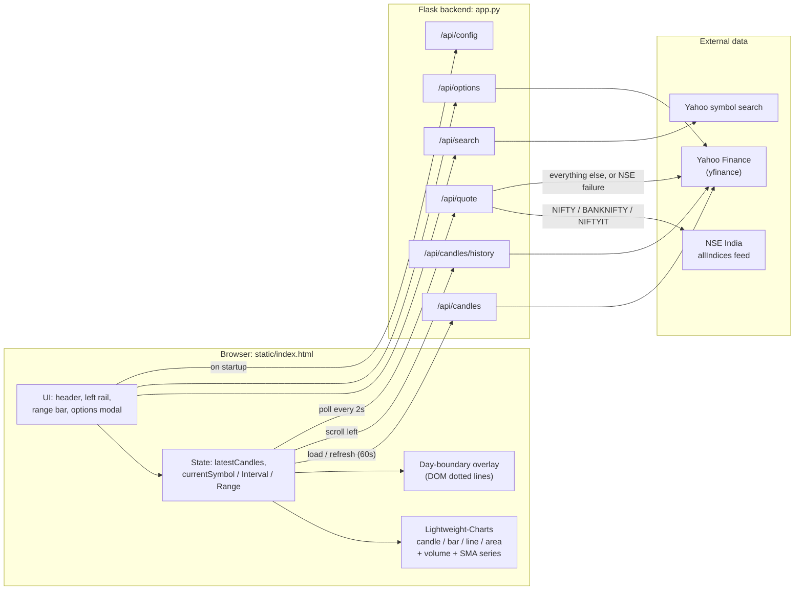
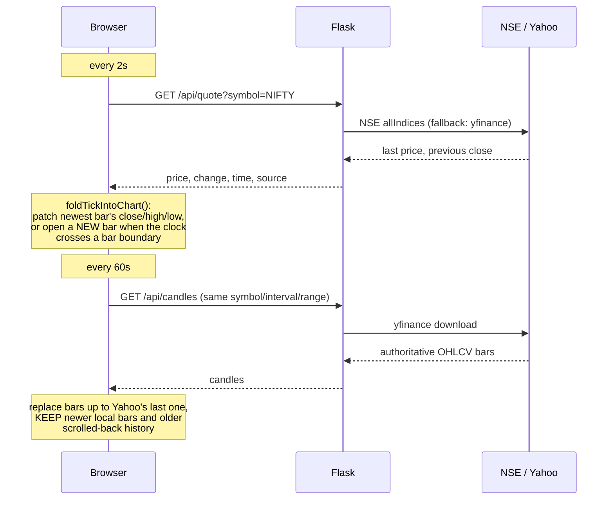
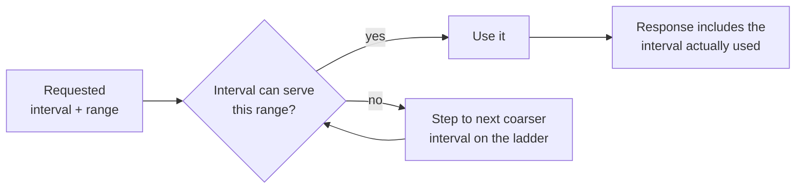
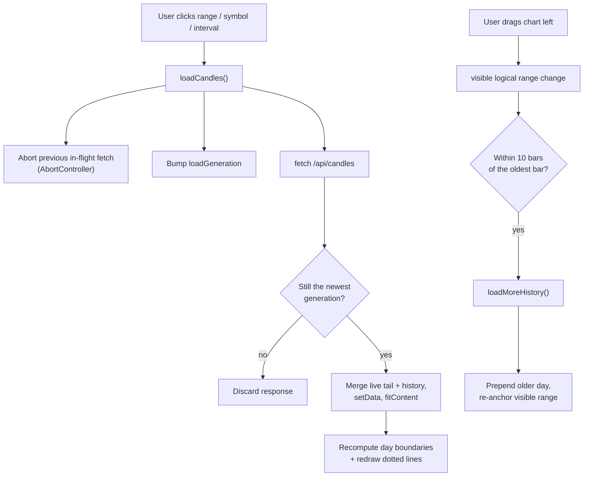

# Orazio

A self-hosted, TradingView-style charting app for Indian and global indices and stocks. A small Flask backend fetches market data from Yahoo Finance (via `yfinance`) and NSE's own index feed. A single-page frontend renders it with [Lightweight-Charts](https://github.com/tradingview/lightweight-charts) v4.

No build step, no database, no API keys.

## Features

- **Live candles.** Quotes poll every 2s. A new candle opens locally at each bar boundary, so the chart is not stuck waiting for Yahoo's delayed bars (see [Live data](#live-data-why-it-does-not-lag)).
- **Low-latency NSE quotes** for NIFTY, BANKNIFTY and NIFTYIT, straight from NSE's index feed, with automatic fallback to Yahoo.
- **Independent interval and range controls.** Bar size (1m / 5m / 15m / 1h / 1D) and history range (1D / 5D / 1M / 3M / 6M / YTD / 1Y / 5Y / All) are separate. Impossible combinations are corrected server-side.
- **Drag left to load older days.** Intraday history loads lazily, one trading day per request, up to Yahoo's limit (about 7 days at 1m).
- **Dotted day-boundary lines** so separate sessions are easy to tell apart.
- **Quick-access rail:** NIFTY, BANKNIFTY, NIFTYIT, SENSEX, SPX, NASDAQ, DOWJONES, KOSPI, TAIEX, CHINA (CSI 300), SSE (Shanghai Composite).
- **Cash / Futures toggle** for SPX, NASDAQ and DOWJONES (ES=F, NQ=F, YM=F).
- **Options chain panel** for symbols Yahoo covers, e.g. US stocks.
- Candles, bars, line and area styles. Optional SMA20 / SMA50. Volume pane. Free-text symbol search.

## Quick start

```bash
git clone https://github.com/prathamkul007-max/trading-view-self-host.git
cd trading-view-self-host
pip install -r requirements.txt
python app.py
```

Open **http://localhost:5000**.

Tested on Python 3.13. The chart library loads from a CDN (`unpkg.com`), so the browser needs internet access.

## Architecture



### Repository layout

| Path | Purpose |
|---|---|
| `app.py` | Flask app: symbol aliases, interval/range validation, all `/api/*` routes |
| `static/index.html` | The whole frontend: markup, CSS and JS in one file |
| `requirements.txt` | `flask`, `flask-cors`, `yfinance` |
| `tasks/` | Spec-driven-development docs: `spec.md`, `plan.md`, `todo.md` |
| `graphify-out/` | Auto-generated knowledge graph of this repo (`graph.html`, `GRAPH_REPORT.md`) |
| `.mcp.json` | Optional Chrome DevTools MCP config for browser-driven testing |

## Live data: why it does not lag

Yahoo publishes each 1-minute bar roughly a minute after it opens, so a chart built only from `/api/candles` can never show the current minute. Orazio builds the newest candle from live ticks instead.



Guards that keep the local candles honest:

- A new bar opens only if the price actually changed in the last 90s, so a frozen post-close quote cannot spawn flat candles.
- Bars are anchored to the last real bar's grid (NSE hourly bars start at :15).
- Live folding only applies while the newest bar is recent (older than `2 × interval + 240s` means market closed or an old range).
- Locally-built bars have zero volume until Yahoo publishes the real bar.

## Interval and range resolution

Yahoo limits how far back each bar size goes, so `resolve_interval_range()` in `app.py` climbs a ladder to the finest interval that can serve the requested range.



| Interval | Max range it can serve |
|---|---|
| 1m | 5D |
| 5m, 15m | 1M |
| 1h | 1Y |
| 1D | All |

The ladder only moves to coarser bars, never finer. To avoid a wide range leaving a stale coarse interval behind, the frontend's range buttons always request `interval=1m` as a baseline.

## API reference

| Route | Params | Returns |
|---|---|---|
| `GET /api/config` | none | `quickIndices` (rail list), `futuresMap` (cash → futures ticker) |
| `GET /api/candles` | `symbol`, `interval`, `range` | `{symbol, interval, range, candles[]}` (interval is the one actually used) |
| `GET /api/candles/history` | `symbol`, `interval`, `before` (unix ts) | One prior trading day of bars strictly before `before`, plus `exhausted` |
| `GET /api/quote` | `symbol` | `{price, change, changePercent, time, currency, source}`; `source` is `nse` or `yfinance` |
| `GET /api/search` | `q` | Yahoo symbol search results |
| `GET /api/options` | `symbol`, `expiry` (optional) | `{available, expiries, calls, puts}`, or `{available: false, reason}` |

Symbols are validated against `^[A-Za-z0-9^.\-=]{1,20}$`. Aliases such as `NIFTY`, `SPX` or `CHINA` are resolved to Yahoo tickers server-side (`SYMBOL_ALIASES` in `app.py`).

## Frontend request lifecycle

The frontend guards against stale responses, which matters because Yahoo round-trips are slow and users click quickly.



Other guards:

- `suppressRangeEvents` stops the scroll listener from reacting to changes the app made itself (`setData`, `fitContent`).
- `pollQuote()` discards a response if the symbol changed while it was in flight.
- `timeScale.minBarSpacing` is lowered to `0.05` so "All" (thousands of daily bars) fits instead of silently clamping to recent data.
- The 60s refresh preserves the visible time range instead of resetting zoom.

## Data sources and limits

| Data | Source | Notes |
|---|---|---|
| Candles, futures, options | Yahoo Finance via `yfinance` | 1m bars reach back about 7 days, 5m/15m about 60 days |
| NIFTY / BANKNIFTY / NIFTYIT quotes | NSE `nseindia.com/api/allIndices` | Unofficial (the endpoint NSE's own site uses), needs a session-cookie handshake, may change or block at any time. Falls back to Yahoo silently |
| Symbol search | Yahoo's public search endpoint | |

Known limitations:

- **Indian index futures and options are not available.** Yahoo does not carry NSE index futures or option chains. The futures toggle only appears for SPX, NASDAQ and DOWJONES. The options panel shows "unavailable" for NIFTY, BANKNIFTY and NIFTYIT.
- Data is unofficial and can be delayed. This is a personal charting tool, not a trading-grade feed.
- Flask's dev server is used (`threaded=True`). Do not expose it to the public internet as is.

## Development

The project uses spec-driven development. Read `tasks/spec.md`, `tasks/plan.md` and `tasks/todo.md` for the requirements, plan and history of bugs and fixes.

`.mcp.json` configures the Chrome DevTools MCP server so an AI coding agent can drive a real browser against `http://localhost:5000` for testing.
